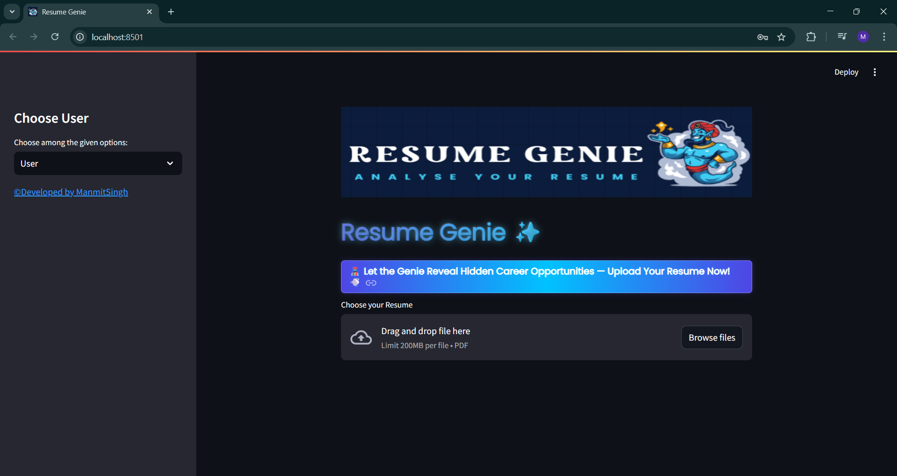
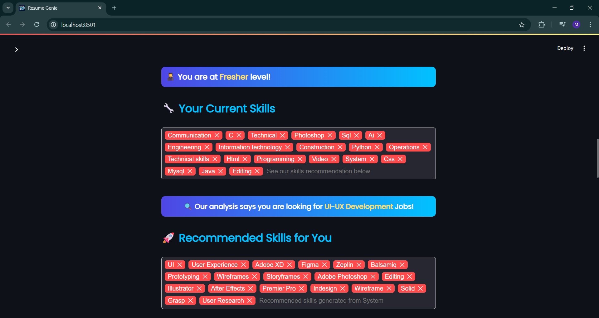

# Resume Genie 🧞

This is a Python and Streamlit web application that analyzes resume PDFs to provide users with a score, career recommendations, and tips for improvement.

## Features
- PDF Resume Parsing
- NLP-Powered Skill Extraction and Recommendation
- Automated Resume Score Calculation
- Secure Admin Dashboard with Analytics

## Setup and Installation

1.  **Clone the repository.**

2.  **Install the required libraries:**
    ```
    pip install -r requirements.txt
    ```

3.  **Download the spaCy model:**
    ```
    python -m spacy download en_core_web_sm
    ```

4.  **Create a secrets file:**
    In the main project folder, create a new folder named `.streamlit`. Inside it, create a file named `secrets.toml` and add your database and admin credentials in the following format:
    ```toml
    [database]
    host = "localhost"
    user = "your_db_user"
    password = "your_db_password"
    db = "cv"

    [admin]
    user = "your_admin_user"
    password = "your_admin_password"
    ```

5.  **Run the application:**
    ```
    streamlit run app.py
    ```

## Demo




## Technologies Used
* **Frontend:** Streamlit
* **Backend:** Python
* **NLP:** spaCy, NLTK, pyresparser
* **Data Analysis:** Pandas
* **Data Visualization:** Plotly Express
* **Database:** MySQL

## Usage
1.  Select "User" from the sidebar menu.
2.  Click the "Browse files" button to upload your resume in PDF format.
3.  View the instant analysis and recommendations that appear on the screen.
4.  (Optional) Select "Admin" and use the credentials in your `secrets.toml` file to view the analytics dashboard.

## License
This project is licensed under the MIT License – see the [LICENSE](LICENSE) file for details.


## Author
- Manmit Singh Chouhan
  
[](https://www.linkedin.com/in/manmit-singh-chouhan)
[](https://github.com/manmitsinghchouhan)
